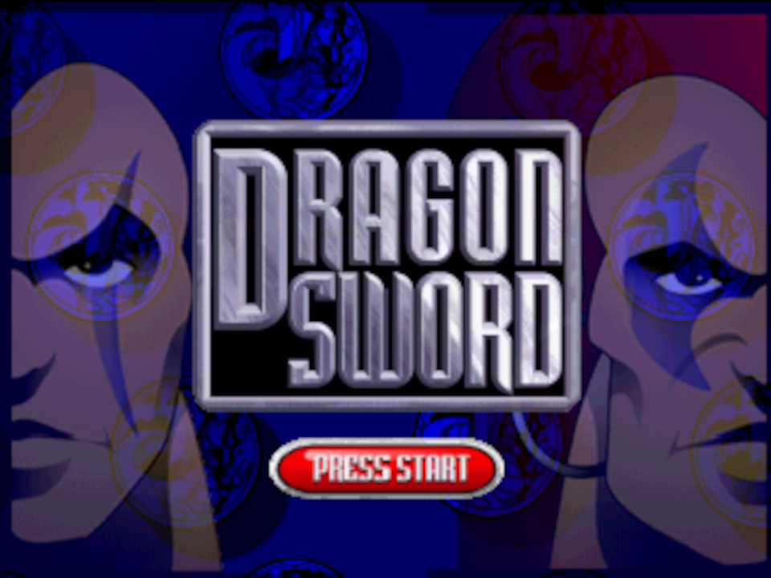

# Dragon Sword

Dragon Sword is a Medieval Sword and Sorcery Combat Game. It takes the best bits of classic 2D beat 'em ups and merges them into an immersive, turn of the millennium, 3D world, where magic and swordplay rule. Players can take control of 1 to 4 different characters in single player or two-player co-op and battle through hordes of evil creatures in challenging and adventurous environments. After fighting through the hordes, players can continue the fight in a four-player deathmatch arena.

Based upon the ideas and designs of the Oliver Twins, Dragon Sword was originally developed by Interactive Studios. While initially scheduled for release in late 1999, Dragon Sword was canceled before completion. Byteswap Labs is now excitedly taking on the challenge of completing the game for N64 and porting it to PC.
