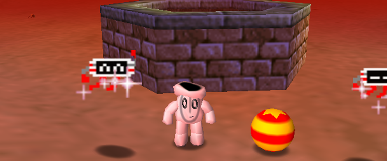
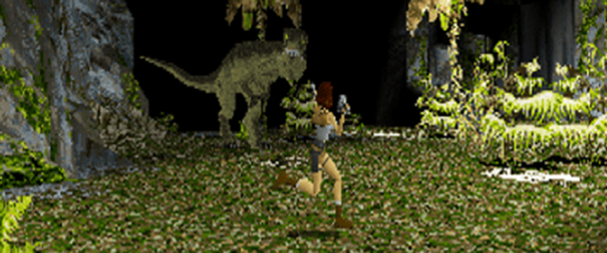
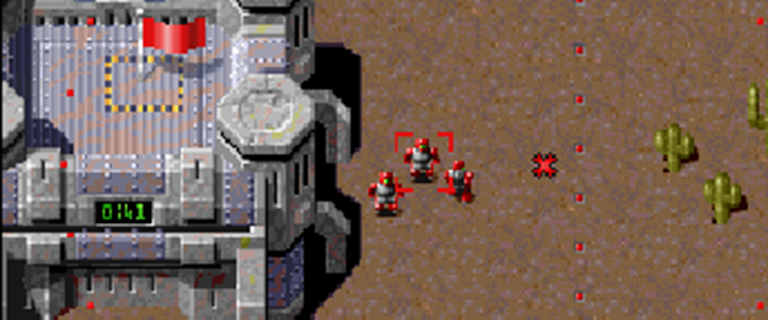
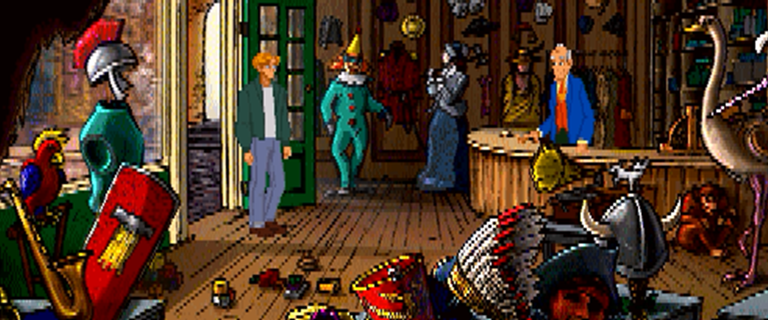

import Card from "../components/card";

# Games

<Card url="/games/dragonsword" fullWidth>

## Dragon Sword

</Card>

<Card url="/games/piko4" fullWidth>

## Piko Interactive Collection 4

</Card>

<Card url="/games/tr1" fullWidth>

## Tomb Raider Collection 1

</Card>

<Card url="/games/bmp2" fullWidth>

## The Bitmap Brothers Collection 2

</Card>

<Card url="/games/lok1" fullWidth>

## Legacy of Kain Collection 1

</Card>

<Card url="/games/bs" fullWidth>

## Broken Sword Collection

</Card>
