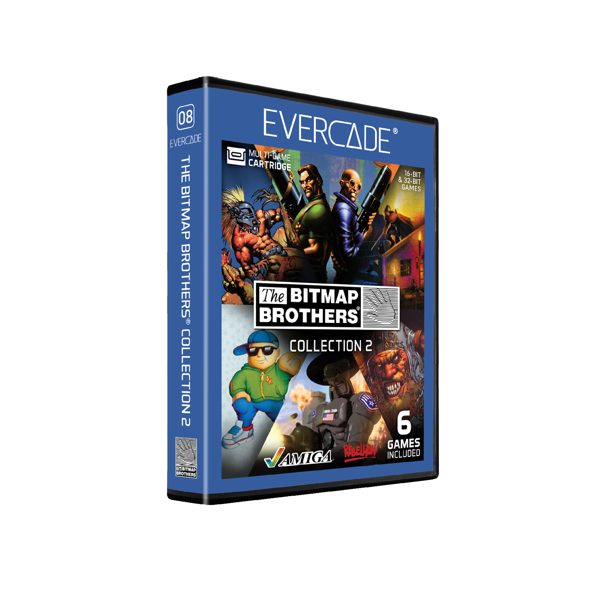

# The Bitmap Brothers Collection 2

## Our Involvement
Byteswap Labs created a brand new build of Z for this Evercade cartridge.

## Overview
The Bitmap Brothers Collection 2 for Evercade brings together five home computer classics from the self-appointed “rock stars” of the British game development scene, including Cadaver and its expansion The Payoff, Gods, Magic Pockets and The Chaos Engine 2, plus the 32-bit home console version of real-time strategy classic Z!

## Z
Eat lead… with Z! This 32-bit real-time strategy classic places a strong emphasis on territory control. As an army of red robots, battle against your blue rivals for supremacy. Aggression is the name of the game, because your opponent certainly isn't going to wait for you!
