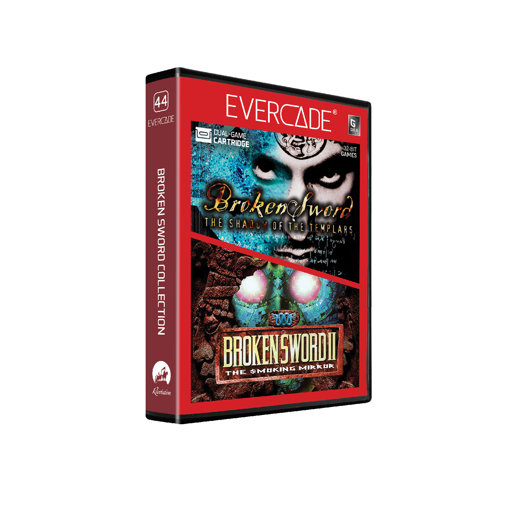

# Broken Sword Collection

## Our Involvement

Byteswap Labs created a brand new build of Broken Sword and Broken Sword II for this Evercade cartridge.

## Overview

Paris in the fall holds many memories for George Stobbart: of cafés, of music, of love, and of death. Now on Evercade, you can explore the first two adventures in this legendary series, presented in their original 32-bit console form.

## Broken Sword: The Shadow of the Templars

Uncover the identity of a jester assassin, unlock the legends of the Knights Templar and unravel a plot as twisted as the catacombs you'll be prowling in this 32-bit point-and-click adventure for Evercade!

## Broken Sword II: The Smoking Mirror

Prepare for the end of the world in this 32-bit point-and-click adventure for Evercade! American tourist George Stobbart returns to save the world from the Mayan god of sacrifice in this thrilling sequel.
