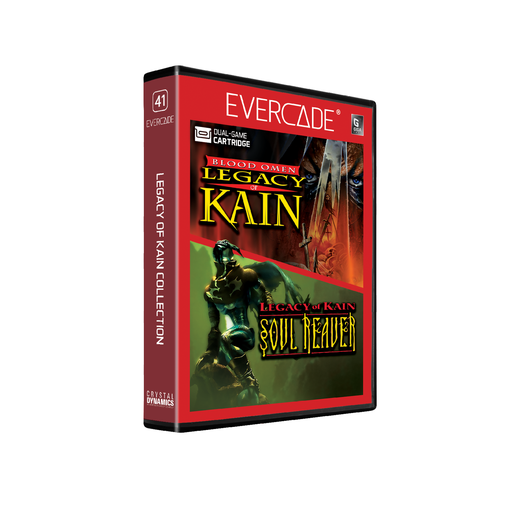

# Legacy of Kain Collection 1

## Our Involvement

Byteswap Labs created a brand new build of Soul Reaver and Blood Omen for this Evercade cartridge.

## Overview

Legacy of Kain Collection for Evercade features the two games that launched the classic Legacy of Kain saga from Crystal Dynamics. Follow the vampire Kain on a quest for revenge in Blood Omen: Legacy of Kain, and in Legacy of Kain: Soul Reaver, the wraith Raziel seeks to strike back at his former master.

## Blood Omen: Legacy of Kain

"Nothing is free. Not even revenge." Discover the truth behind these words in this 32-bit classic for Evercade. Guide the vampire Kain on his quest for vengeance against his murderers in an epic role-playing adventure filled with dark deeds and brooding atmosphere.

## Legacy of Kain: Soul Reaver

In this 32-bit Gothic horror classic for Evercade, the vampire Raziel was executed for the deadly sin of evolving before his master Kain. Now returned as a wraith, he seeks to take down the one he once called "Master". Shift between the Material and Spectral Planes to solve puzzles and defeat your powerful foes.
