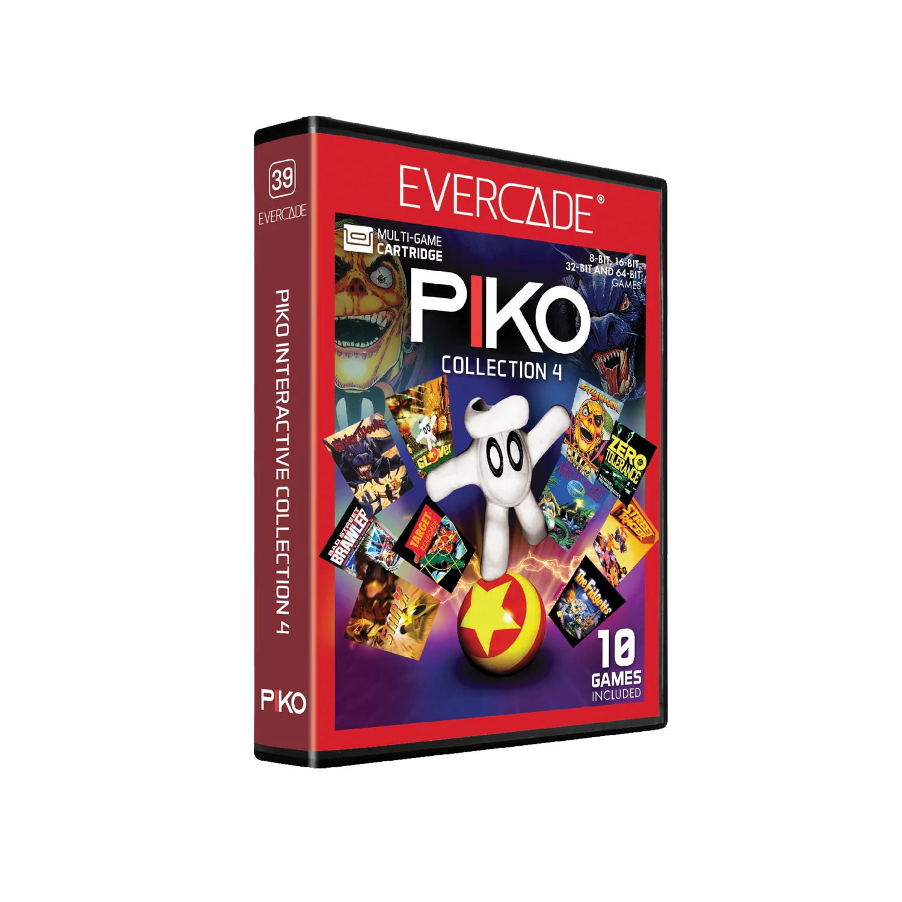

# Piko Interactive Collection 4

## Our Involvement
Byteswap Labs created a brand new build of Glover from the original source code and files found within source code backups for the Evercade.

## Overview
Charming 64-bit 3D platformer action comes to Evercade with Glover and his ball-bouncing quest to recover the Crystal Castle's most precious treasures.

## Glover
Piko Interactive Collection 4 brings together 10 great games that span the 8 to 64-bit eras, including 3D platformer Glover, the atmospheric Risky Woods, Randell Reiss’ impressive 16-bit first-person shooter Zero Tolerance Underground and more!
