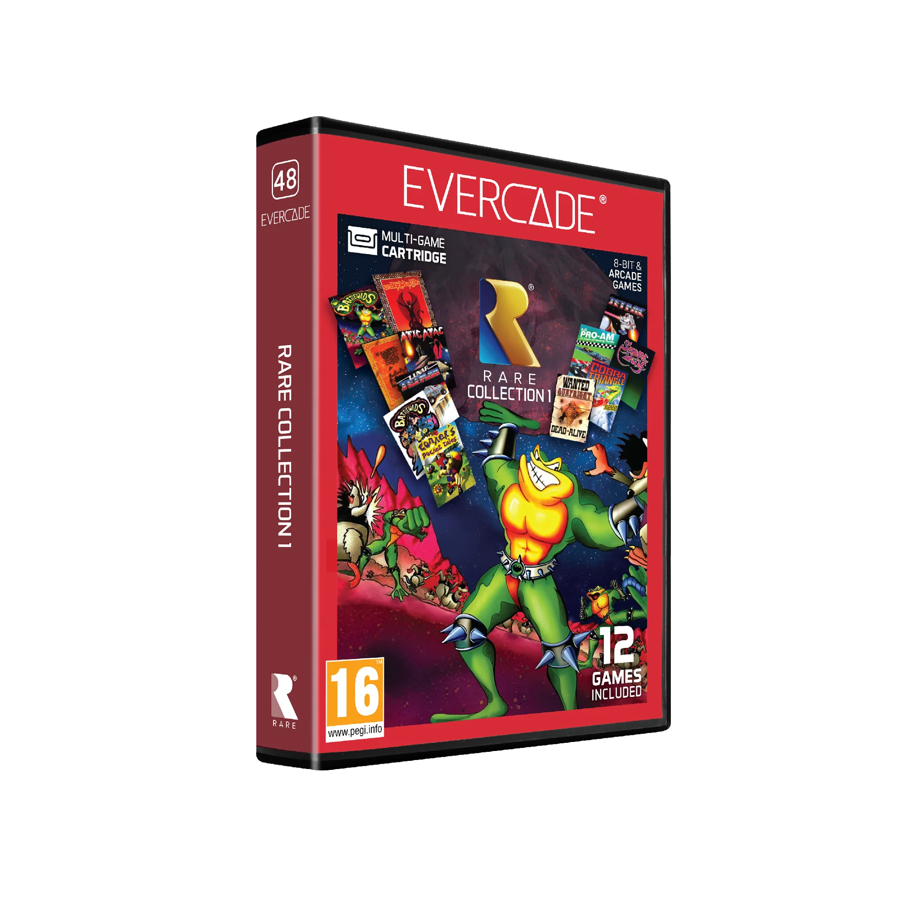

# Rare Collection 1

## Our Involvement

Using binary modification techniques Byteswap Labs created emulator patches for the following games on this Evercade cartridge: Jetpac, Lunar Jetman, Atic Atac, Sabrewulf, Underwurlde, Knight Lore, and Gunfright.

## Overview

Rare is one of the best-known names in British game development, and in this collection for Evercade you’ll explore 12 all-time favourites. Includes the home computer classics Jetpac, Atic Atac, Knight Lore and more. Plus, race on land and sea with the 8-bit console hits R.C. Pro-Am and Cobra Triangle, rescue a ruined birthday in Conker’s Pocket Tales, and kick the Dark Queen’s butt in the 8-bit console and arcade versions of Battletoads!

## Jetpac

Rare's earliest game is one of its most famous! Build rockets, refuel them and get rich in this beloved home computer game, now available for Evercade.

## Lunar Jetman

The aliens are mustering for an attack on Earth in Rare's follow-up to Jetpac. Drive your lunar rover, collect useful tools and thwart the attack in this home computer classic for Evercade.

## Atic Atac

Trapped in the Haunted Castle, your only way out is to find all three parts of a special key! Frantic action and adventure awaits in this home computer hit by Rare, now on Evercade.

## Sabrewulf

Rare's Sabreman series begins with a jungle adventure. Explore a huge map, battle wildlife and seek a magic amulet in this home computer classic for Evercade.

## Underwurlde

The only way is down, then back up again in the second Sabreman adventure from Rare! Delve into the depths of the Underwurlde in search of magic weapons in this home computer favourite, now for Evercade.

## Knight Lore

Rare's Sabreman series continues with the influential isometric action-adventure Knight Lore. Can you save Sabreman from a deadly curse in this home computer classic for Evercade?

## Gunfright

The West was won from a quasi-3D perspective in this all-action, rootin' tootin' isometric adventure from Rare. Track down bandits and show 'em the justice of the Old West in this home computer hit for Evercade.
