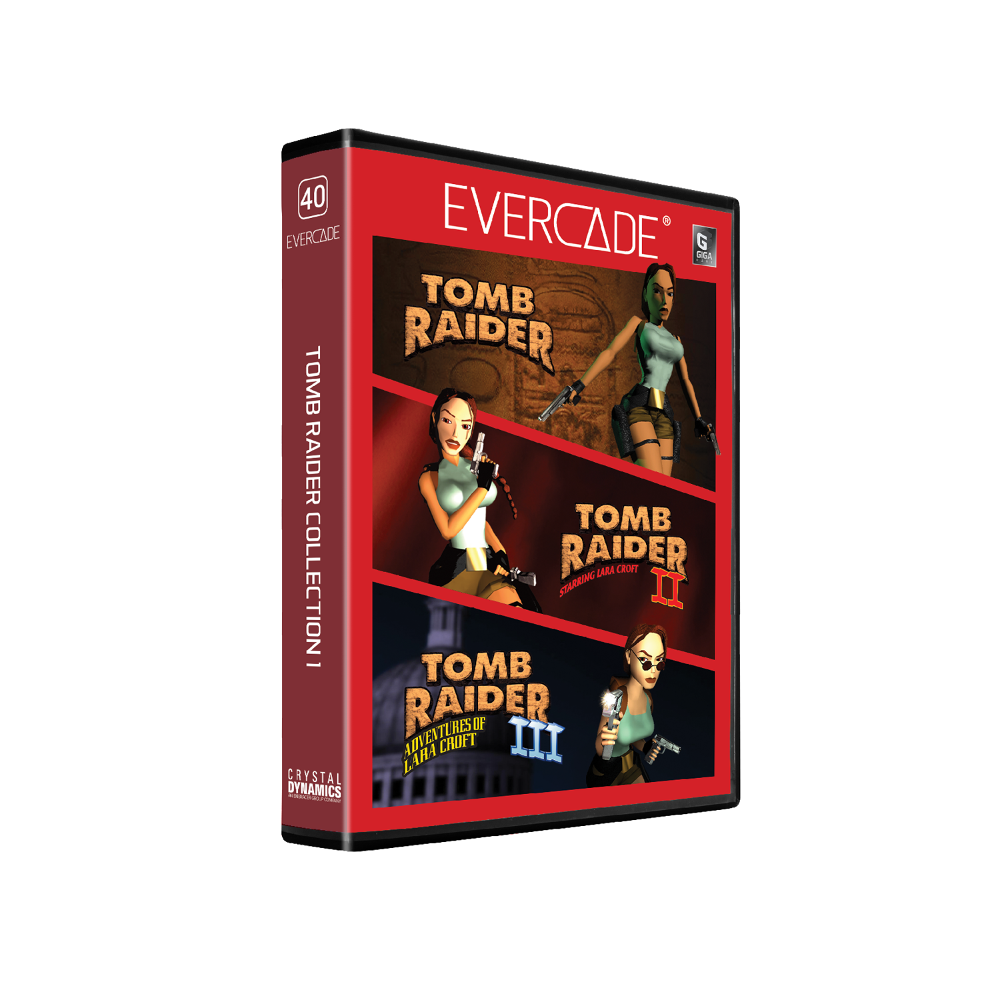

# Tomb Raider Collection 4

## Our Involvement
Byteswap Labs created a brand new build of Tomb Raider 1-3 for this Evercade cartridge.

## Overview
A legend begins! Tomb Raider Collection 1 for Evercade includes the first three published adventures of the world’s most famous acrobatic archaeologist, including Tomb Raider, Tomb Raider II Starring Lara Croft and Tomb Raider III: Adventures of Lara Croft!

## Tomb Raider
Tomb Raider brings Lara Croft's first published adventure to Evercade. Delve into unexplored ruins in search of a mystical artefact, but beware of ancient traps, perilous environments and the local wildlife!

## Tomb Raider II
Tomb Raider II comes to Evercade, chronicling Lara Croft's globetrotting quest for the Dagger of Xian. Visit the Great Wall of China, the canals of Venice, the mountains of Tibet and even the ocean floor in search of the truth behind the legend.

## Tomb Raider III
In Tomb Raider III for Evercade, Lara Croft sets off on another adventure around the world, this time taking in the jungles of India, islands in the South Pacific, the deserts of Nevada, the streets of London and even the frozen wastes of Antarctica.