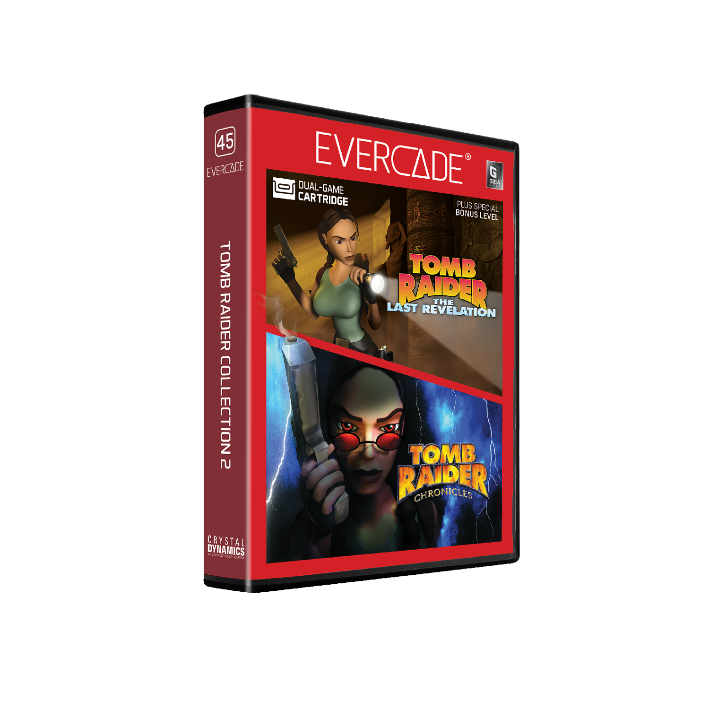

# Tomb Raider Collection 2

## Our Involvement

Byteswap Labs created a brand new build of Tomb Raider 4-5 for this Evercade cartridge. Using reverse engineering, we also added the bonus level "The Times" for the first time on an official PS1 build of the game!

## Overview

The legend of Lara Croft continues on Evercade! Uncover an ancient Egyptian mystery and prevent the end of the world in Tomb Raider: The Last Revelation, and relive a series of Lara’s most noteworthy adventures from her past in Tomb Raider: Chronicles. Also includes a brand-new version of a special bonus level, previously only distributed for home computers.

## Tomb Raider: The Last Revelation

Lara Croft returns to Evercade in an all-action Egyptian adventure. The dread god Set's resurrection is at hand, and the fate of the world is at stake! Can Lara save the day? Also includes a special bonus level previously only distributed on PC!

## Tomb Raider: Chronicles

In Tomb Raider: Chronicles for Evercade, three individuals have come together to commemorate the life and career of Lara Croft. As they tell their stories, relive those classic adventures for yourself!
